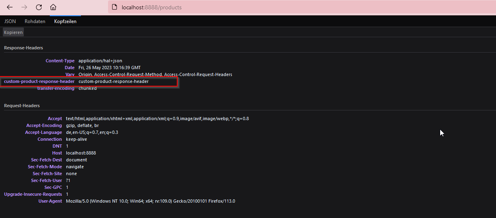

# spring-cloud-gateway
Implementing and interacting with multiple microservices using a single entry point (proxy) based on spring cloud gateway
# development
- the first step is limited to develop products- && customers-services and configuring the gateway
    to send requests to those both services. the gateway configuration is first property-based
    and then java based using the RouteLocator java class. 
- in a second step, the Discovery service will be enabled.

# adding filters to the gateway
